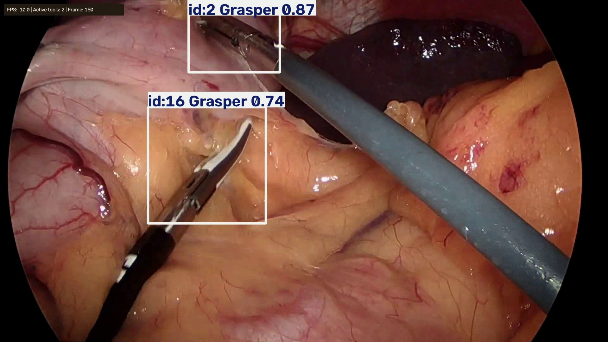
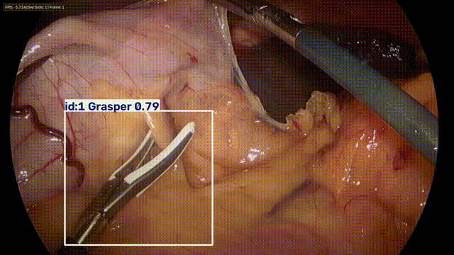

# Surgical Tool Detection and Tracking

**Laparoscopic Surgical Instrument Detection via YOLOv11 (with ByteTrack Integration Experiments).** This project combines a custom-trained YOLO detector with Bytetrack implimentation.

  

  

*Sample annotated frames from the test set.*

### Demos




*The frame above shows tracked surgical instruments with class labels, confidence scores, persistent IDs, and real-time display FPS.*

## Model Architecture
I selected **YOLOv11s** (9.4M parameters). This model architecture was chosen for its strong balance between detection accuracy and lightweight computational footprint, making it suitable for real-time tracking integration using **ByteTrack** (Object Tracking by Associating Every Detection Box).

## Dataset and training
The model was trained using the [Cholec80 Computer Vision Dataset](https://universe.roboflow.com/daad-mobility/cholec80/dataset/3#) (Roboflow version 3), consisting of 8,263 annotated frames with $224 \times 224$ resolution (resized to $640 \times 640$ resolution for training) across 7 surgical tool categories.

Due to severe class imbalance (e.g., *Scissors* being significantly under-represented compared to *Grasper* or *Hook*), an iterative training and data augmentation strategy was applied:

1. **Initial Baseline (30 Epochs)**:
   - **mAP50**: 93.53% | **mAP50-95**: 54.91%
   - **Precision**: 94.97% | **Recall**: 88.54%
   - *Observation*: High accuracy across most tools, but lower performance on rare classes (*Scissors* mAP50 was capped at ~82.5%).

2. **Targeted Data Augmentation (20 Epochs Fine-Tuning)**:
   - Applied class-focused spatial augmentations (including Copy-Paste and scale adjustments) to generate synthetic variations of rare tool instances, improving feature extraction for *Scissors*.

3. **Domain Robustness & Blur Augmentations**:
   - Added motion blur and Gaussian noise augmentations to simulate real-world laparoscopic environments (surgical smoke, camera lens smudges, and rapid tool movement), enhancing model generalization on low-visibility video sequences.


## Results at a Glance

### Performance Metrics on Test Set

| Class | Images | Instances | Precision (P) | Recall (R) | mAP50 | mAP50-95 |
| :--- | :---: | :---: | :---: | :---: | :---: | :---: |
| **All** | **1015** | **1782** | **0.903** | **0.897** | **0.930** | **0.552** |
| Bipolar | 96 | 96 | 0.883 | 0.958 | 0.949 | 0.537 |
| Clipper | 80 | 80 | 0.847 | 0.901 | 0.948 | 0.540 |
| Grasper | 649 | 818 | 0.885 | 0.875 | 0.904 | 0.533 |
| Hook | 459 | 460 | 0.970 | 0.978 | 0.983 | 0.605 |
| Irrigator | 123 | 123 | 0.974 | 0.919 | 0.955 | 0.569 |
| Scissors | 40 | 40 | 0.824 | 0.704 | 0.801 | 0.463 |
| Specimen Bag | 165 | 165 | 0.936 | 0.945 | 0.968 | 0.617 |

* **Inference Speed**: 1.2ms preprocess, 9.9ms inference, 0.8ms postprocess per image.

### Measured `test_video2` run

| Metric | Value |
|---|---:|
| Source duration | 25.0 s |
| Source FPS | 30.0 |
| Processed frames | 750 |
| Detection coverage | 99.33% |
| Mean detections/frame | 1.5053 |
| Mean confidence | 0.6975 |
| Unique track IDs | 37 |
| Longest track | 293 frames |
| Inference FPS, CPU | 10.18 |
| Latency p50 / p95 | 94.33 / 110.32 ms |

This is a runtime and behavior report, not tracking accuracy. `test_video2` has
no official tracking labels, so precision, recall, MOTA, IDF1, and HOTA are not
reported for it. The full report is saved under `outputs/test_video2_report/`.

## Why this project matters

The project is deliberately small and measurable: one inference entry point, one diagnostic evaluator, and one utility for creating reproducible video clips. It demonstrates machine learning, geometry in image coordinates, temporal association, experimental protocol, and deployment trade-offs rather than only showing a model prediction.

## Demo

The main demonstration should be a 15-30 second video showing:

1. several tools entering and leaving the image;
2. bounding boxes, classes, confidence, and persistent track IDs;
3. an occlusion or crossing case;
4. the measured processing FPS and source FPS;
5. one failure case, kept visible and explained.

Keep one short annotated video or GIF under `experiments/docs/assets/`. A 10-second
GIF preview is already generated from `test_video2`:

```markdown

```

The full local result is `outputs/test_video2_tracked.mp4`. Publish it only if the
source video is legally redistributable; otherwise publish the GIF only when its
use is permitted, or link to the original source instead.

## What this demonstrates

- object detection with confidence filtering and seven surgical-tool classes;
- persistent multi-object identities with ByteTrack;
- reproducible video inference and annotated output;
- performance measurement instead of an unverified "real-time" claim;
- a clear boundary between diagnostic proxies and scientific accuracy metrics.

## Project structure

```text
main.py                # only runtime entry point
src/tracker.py         # YOLO + ByteTrack implementation
models/best.pt         # local model weights
data/                  # local input videos and samples
outputs/               # current generated result only
experiments/           # optional preparation, evaluation, and training tools
```

## Installation

Toutes les commandes utiles, de la decoupe jusqu'a la creation du GIF GitHub,
sont rassemblees dans [COMMANDS.md](COMMANDS.md).

```powershell
python -m venv venv
.\venv\Scripts\Activate.ps1
python -m pip install -r requirements.txt
```

Use the virtual-environment interpreter explicitly in VS Code if the terminal
does not activate it: `venv\Scripts\python.exe`.

## Model and data assets

The trained weights and surgical videos are intentionally excluded from Git
because they are large and may have dataset-specific distribution terms. Put
the exported `best.pt` at `models/best.pt` and a local clip at
`data/test_video.mp4`. For a public repository, provide a documented release
link for the weights and a short legally redistributable demo clip or GIF.

The current local model is YOLO11s v2 trained on Cholec80. Its validation and
comparison summary is recorded in `reports/training_yolo11s_v2/summary.md`.

## Prepared local video data

The extracted image sequences are also assembled locally as plain 10 FPS videos
for repeatable experiments. No tracking or model output is embedded in these files:

```text
data/
  video41/
    video41_10fps.mp4
    video41_tracking_gt.csv
  video42/
    video42_10fps.mp4
    video42_tracking_gt.csv
  video43/
    video43_10fps.mp4
    video43_tracking_gt.csv
  video44/
    video44_10fps.mp4
    video44_tracking_gt.csv
  video45/
    video45_10fps.mp4
    video45_tracking_gt.csv
```

The CSV files contain the project-specific reference boxes and reconstructed
track IDs for the corresponding frame sequence. They are targets for evaluation,
not official tracking ground truth. Use a prepared video as input to the model,
then export predictions to a separate output folder:

```powershell
python main.py `
  --model models/best.pt `
  --source data/video41/video41_10fps.mp4 `
  --output outputs/video41_tracked.mp4 `
  --device cpu
```

For cutting experiments, keep the original frame sequence or cut the prepared
10 FPS MP4 consistently. The CSV frame names refer to the original PNG names.

## Run inference

```powershell
python main.py `
  --model models/best.pt `
  --source data/test_video.mp4 `
  --output outputs/tracked_video.mp4 `
  --confidence 0.25 `
  --imgsz 640 `
  --device 0
```

Add `--display` for an OpenCV preview. `--device 0` selects the first CUDA
GPU; omit it to let Ultralytics choose. Lowering `--imgsz` can increase
throughput, but every speed/accuracy trade-off must be benchmarked.

## Optional experiments

The simple public workflow is only video -> YOLO -> ByteTrack. Tools beyond that
path are kept in `experiments/tools/` so they do not obscure the main project.
Use them only when preparing a benchmark or training dataset.

```text
experiments/tools/cut_video.py
experiments/tools/evaluate_tracking.py
experiments/tools/evaluate_tracking_reference.py
experiments/tools/prepare_yolo_dataset.py
experiments/tools/reconstruct_tracking_gt.py
experiments/configs/
experiments/docs/
experiments/reports/
experiments/notebooks/
experiments/archives/
```

The reference CSVs are project-specific targets reconstructed from frame
annotations, not official tracking ground truth. Keep the source frame order when
cutting clips; the current CSVs use the original PNG frame names.

## Optional runtime measurement

```powershell
python experiments/tools/evaluate_tracking.py `
  --model models/best.pt `
  --source data/test_video2.mp4 `
  --report-dir reports/tracking_video2 `
  --imgsz 640 `
  --device 0
```

The report contains `summary.md`, `summary.json`, `frame_metrics.csv`, and
`track_metrics.csv`. It measures source FPS, inference FPS, p50/p95 inference
latency, detection coverage, confidence, track duration, ID reappearance gaps,
and a boolean verdict for reaching the source FPS.

The current local CPU report is about 5-6 inference FPS on a 30 FPS video. The
annotated MP4 can still be encoded at 30 FPS, but that does not mean the
system is real-time. A credible real-time claim must state hardware, input
resolution, model version, batch size, and whether capture, inference,
annotation, and display are included.

## Presentation guidance

For detection, report mAP@50, mAP@50:95, precision, recall, and per-class
results on a held-out test split. The existing archive values are not enough
without the dataset split and evaluation protocol.

Use a real, legally distributable video for the main qualitative demo. Without
official temporal identity labels, do not present reconstructed tracking metrics
as clinical or official tracking accuracy.

For deployment, report mean/p50/p95 latency, end-to-end FPS, source FPS,
hardware, resolution, and memory. The target is usually at least 25 FPS for a
low-latency live display, but the correct target depends on the clinical use
case; offline analysis has no 25 FPS requirement.

## Recommended next milestones

1. Add a small, documented ground-truth test split with identity labels.
2. Benchmark CPU, CUDA, and smaller input sizes using the same clip and report
	the result in a table.
3. Add a short failure analysis: occlusion, glare, tool overlap, blur, and
	class imbalance.
4. Export one short demo video and one compact report that can be understood
	without opening the source code.

This is a research/engineering portfolio project, not a clinical device. No
clinical performance or safety claim should be inferred from these videos.

v1:
                  Class     Images  Instances      Box(P          R      mAP50  mAP50-95): 100% ━━━━━━━━━━━━ 64/64 3.8it/s 16.7s0.2s
                   all       1015       1782       0.95      0.885      0.935      0.549
               Bipolar         96         96      0.972      0.948      0.974      0.526
               Clipper         80         80        0.9        0.9      0.948      0.532
               Grasper        649        818      0.931      0.845      0.911      0.543
                  Hook        459        460      0.971      0.974      0.973      0.595
             Irrigator        123        123      0.978      0.878      0.948      0.543
              Scissors         40         40      0.934      0.725      0.834      0.487
          Specimen Bag        165        165      0.962      0.927      0.959      0.618
Speed: 1.2ms preprocess, 9.7ms inference, 0.0ms loss, 1.1ms postprocess per image
Saving /kaggle/working/results/test_cholec80_metrics/predictions.json...

--- Résultats sur le jeu de TEST ---
mAP50-95 : 0.5491
mAP50    : 0.9353
Précision: 0.9497
Rappel   : 0.8854

v2 :
                Class     Images  Instances      Box(P          R      mAP50  mAP50-95): 100% ━━━━━━━━━━━━ 64/64 3.8it/s 17.0s0.3s
                   all       1015       1782      0.947      0.879      0.929      0.554
               Bipolar         96         96      0.967      0.958      0.953      0.539
               Clipper         80         80      0.948      0.917      0.953      0.528
               Grasper        649        818      0.918      0.839      0.903      0.537
                  Hook        459        460      0.969       0.95      0.972      0.603
             Irrigator        123        123      0.982      0.868      0.947      0.568
              Scissors         40         40       0.88        0.7      0.825      0.481
          Specimen Bag        165        165      0.962      0.919      0.951      0.618

--- Résultats sur le jeu de TEST ---
mAP50-95 : 0.5535
mAP50    : 0.9290
Précision: 0.9465
Rappel   : 0.8788


v3 :
                 Class     Images  Instances      Box(P          R      mAP50  mAP50-95): 100% ━━━━━━━━━━━━ 64/64 3.8it/s 16.9s0.3s
                   all       1015       1782      0.903      0.897       0.93      0.552
               Bipolar         96         96      0.883      0.958      0.949      0.537
               Clipper         80         80      0.847      0.901      0.948       0.54
               Grasper        649        818      0.885      0.875      0.904      0.533
                  Hook        459        460       0.97      0.978      0.983      0.605
             Irrigator        123        123      0.974      0.919      0.955      0.569
              Scissors         40         40      0.824      0.704      0.801      0.463
          Specimen Bag        165        165      0.936      0.945      0.968      0.617
Speed: 1.2ms preprocess, 9.9ms inference, 0.0ms loss, 0.8ms postprocess per image

--- Résultats sur le jeu de TEST ---
mAP50-95 : 0.5518
mAP50    : 0.9296
Précision: 0.9028
Rappel   : 0.8973