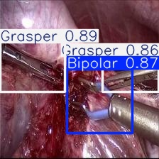
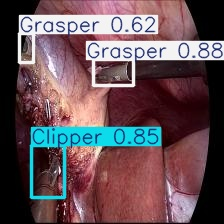
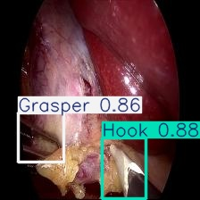
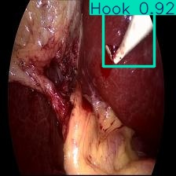
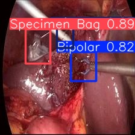
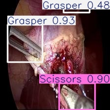
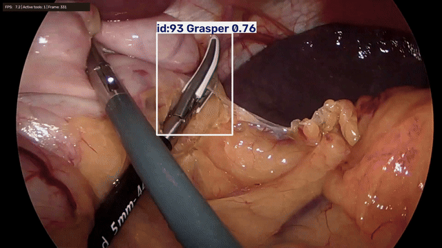
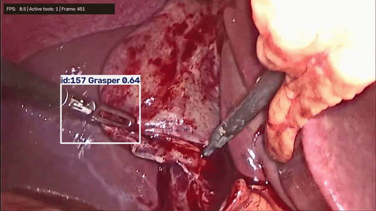

# Surgical Tool Detection and Tracking

**Laparoscopic Surgical Instrument Detection via YOLOv11 (with ByteTrack Integration Experiments).** This project combines a custom-trained YOLO detector with Bytetrack implimentation.

  

  

*Sample annotated frames from the test set.*

### Demo

![YOLO + ByteTrack demo[1]](presentation/v3_test2_11s_14s.gif)

*The frame above shows tracked surgical instruments with class labels, confidence scores, persistent IDs, and real-time display FPS.*

## Model Architecture
I selected **YOLOv11s**[3] (9.4M parameters). This model architecture was chosen for its strong balance between detection accuracy and lightweight computational footprint, making it suitable for real-time tracking integration using **ByteTrack**[4] (Object Tracking by Associating Every Detection Box).

## Dataset and training
The model was trained using the [Cholec80 Computer Vision Dataset](https://universe.roboflow.com/daad-mobility/cholec80/dataset/3#) (Roboflow version 3), consisting of 8,263 annotated frames with $224 \times 224$ resolution (resized to $640 \times 640$ resolution for training) across 7 surgical tool categories.

Due to severe class imbalance (e.g., *Scissors* being significantly under-represented compared to *Grasper* or *Hook*), an iterative training and data augmentation strategy was applied:

1. **Initial Baseline (30 Epochs)**:
   - **mAP50**: 93.53% | **mAP50-95**: 54.91%
   - **Precision**: 94.97% | **Recall**: 88.54%
   - *Observation*: High accuracy across most tools, but lower performance on rare classes (*Scissors* mAP50 was capped at ~82.5%).

2. **Targeted Data Augmentation (20 Epochs Fine-Tuning)**:
   - Applied class-focused spatial augmentations (including Copy-Paste and scale adjustments) to generate synthetic variations of rare tool instances, improving feature extraction for *Scissors*.

3. **Domain Robustness & Blur Augmentations**:
   - Added motion blur and Gaussian noise augmentations to simulate real-world laparoscopic environments (surgical smoke, camera lens smudges, and rapid tool movement), enhancing model generalization on low-visibility video sequences.

## Results at a Glance

### Performance Metrics on Test Set

| Class | Images | Instances | Precision (P) | Recall (R) | mAP50 | mAP50-95 |
| :--- | :---: | :---: | :---: | :---: | :---: | :---: |
| **All** | **1015** | **1782** | **0.903** | **0.897** | **0.930** | **0.552** |
| Bipolar | 96 | 96 | 0.883 | 0.958 | 0.949 | 0.537 |
| Clipper | 80 | 80 | 0.847 | 0.901 | 0.948 | 0.540 |
| Grasper | 649 | 818 | 0.885 | 0.875 | 0.904 | 0.533 |
| Hook | 459 | 460 | 0.970 | 0.978 | 0.983 | 0.605 |
| Irrigator | 123 | 123 | 0.974 | 0.919 | 0.955 | 0.569 |
| Scissors | 40 | 40 | 0.824 | 0.704 | 0.801 | 0.463 |
| Specimen Bag | 165 | 165 | 0.936 | 0.945 | 0.968 | 0.617 |

* **Inference Speed**: 1.2ms preprocess, 9.9ms inference, 0.8ms postprocess per image.

### Video tracking

Unfortunatelly I cant provide official tracking labels, so precision, recall, MOTA, IDF1, and HOTA are not reported.

## Bytetrack

To extend frame-by-frame detection into temporal video tracking, **ByteTrack** was integrated with the fine-tuned YOLOv11s detector. 

* **Tracking Methodology**: ByteTrack keeps low-confidence detection boxes instead of discarding them, associating them with existing tracks using Kalman Filter trajectory prediction and Intersection over Union (IoU) matching. This approach significantly reduces identity switches (ID switches) when tools are partially occluded by tissue or obscured by surgical smoke.
* **Hyperparameter Configuration**:
  * `track_thresh` (**0.25**): Confidence threshold for initial track creation.
  * `track_buffer` (**30 frames**): Memory window to retain lost trajectories during temporary tool exits or severe occlusions.
  * `match_thresh` (**0.80**): IoU cost matrix threshold for associating bounding boxes across consecutive frames.
* **Hardware & Runtime Performance**: Video processing was executed locally on an Intel Core i7-1255U CPU, maintaining an average inference speed of **~10 FPS**.

### Qualitative Challenges & Edge Cases

While single-frame evaluation yields strong metrics on static test sets, real-time video tracking presents domain-specific challenges due to tool appearance variations, rapid movements, and visual interference:

* **High-Visibility Baseline [1]**: Clear video feeds with high contrast yield smooth, continuous tracking trajectories and persistent IDs.
  
  

* **Complex Medical Environments [2]**: Visual obstacles such as surgical smoke, blood spray, and partial tissue occlusions significantly degrade bounding box detection, causing transient track loss or ID swaps.

  

*Note: Due to the absence of frame-by-frame ground-truth tracking annotations in the dataset, standard MOT metrics (MOTA, IDF1, HOTA) are omitted in favor of qualitative video analysis.*

## Key Insights & Technical Takeaways

* **Successful Detector Training**: Fine-tuning YOLOv11s with targeted data augmentations (Copy-Paste, motion blur, scaling) proved highly effective. It achieved correct detection accuracy (93% mAP50).
* **Detection vs. Tracking Gap**: While single-frame detection succeeded, applying ByteTrack to real surgical videos revealed major stability limits. Visual interferences (surgical smoke, blood, tissue coverage) frequently disrupt bounding boxes, showing that strong detection metrics on static frames do not guarantee reliable temporal tracking.
* **The Video Data Bottleneck**: Reliable tracking cannot be achieved or evaluated using frame-by-frame datasets alone. Dedicated, densely annotated video datasets are strictly required to properly train temporal association models and compute quantitative tracking metrics (MOTA, IDF1, HOTA).
* **Exploratory Proof of Concept**: This project demonstrates the potential of lightweight YOLO models in laparoscopic computer vision, while highlighting why zero-shot video tracking remains experimental and unreliable without video-native ground truth.

## References
* [1] [V361 Laparoscopic Completion Cholecystectomy](https://www.youtube.com/watch?v=tZ7RciyNkn0&t=21s)
* [2] [Laparoscopic Sleeve Gastrectomy: Surgical Technique](https://www.youtube.com/watch?v=fecXdNs6rp0&t=215s)
* [3] [Ultralytics YOLO11 Documentation](https://docs.ultralytics.com/models/yolo11)
* [4] [ByteTrack: Multi-Object Tracking by Associating Every Detection Box](https://arxiv.org/abs/2110.06864)